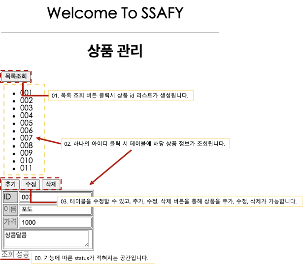

<b>과제를 수행하며 작성한 스프링 프레임워크 웹 프로젝트입니다.</b>

## 01. HW_SF_01_DI
xml 파일을 활용한 의존성 주입(Dependency Injection) 연습 <br>
* <b>applicationContext.xml :</b> Application에서 사용할 Spring 자원들을 설정하는 파일입니다.
> Spring Container는 ProductRepoImpl.java 파일에서 setDataSource를 통해 Spring 자원을 자동으로 얻어옵니다.
> DB와의 연결을 맺고 끊는 단계를 줄여줍니다. <br>
<br>

## 02. HW_SF_02_MVC
스프링 MVC 프로젝트 연습 <br>
> 프로젝트 생성 방법:  Spring Legacy Project -> Spring MVC Project <br>
1. `@Controller` 어노테이션으로 controller 클래스를 작성하고, jsp 파일을 호출하는 기능
2. jsp 파일에서 result URL 요청시 폼내의 입력된 이름을 콘솔에 출력 (변수 하나)
3. jsp 파일에서 result URL 요청시 폼내의 입력된 이름, 직업을 콘솔에 출력 (변수 두개 이상)<br>
* 이때, 이름, 직업을 userDto로 관리했습니다. 모델의 변수명과 form 내의 input 태그의 name 속성이 모두 맞다면 따로 맵핑하는 함수가 없어도 컨트롤러 함수에 자동으로 받아옵니다. <br>
4. 계산기 기능을 구현했습니다. 
<br>

## 03. HW_SF_03_DI_MVC_DB
> 스프링 MVC + DI + DB 연습 <br>
* 기존 xml 방식 DI 에서 annotation(`@`)과 java config file을 이용한 DI 방식으로 변경했습니다.<br>
* 상품 등록 및 상품 목록 기능을 구현했습니다.<br>
<br>

## 04. HW_SF_04_MyBatis
> Spring & MyBatis <br>
ORM(Object Relational Mapping) Framework 인 MyBatis를 적용해 product CRUD 기능을 구현했습니다. <br>
* 수동적인 parameter 설정과 Query 결과에 대한 mapping 구문을 제거했습니다.
* root-context.xml 파일에 sql mapper 파일의 위치를 지정합니다.
* sql mapper file(product.xml) 에는 CRUD에 대한 SQL문이 작성되어 있습니다. 이 파일에서 Dao와의 mapping이 일어납니다.
   * 기존 ProductDaoImpl.class 기능을 product.xml에서 하기 때문에 삭제됐습니다.  
* 서비스 클래스에서는 `@Autowired` 어노테이션으로 SqlSession을 통해 Dao 인터페이스의 기능을 사용합니다.
* mybatis-config.xml 파일에는 Product Dto를 간결하게 작성하기 위한 alias가 작성되어 있습니다.
 
<br><br>

## 05. HW_SF_05_RestAPI

> 상품 관리 서비스에서 Restful API를 구현하여 AJAX 요청을 처리한 프로젝트입니다.

1. `jackson-databind`: Json 형태의 자료 변환을 위한 dependency
2. 상품목록 조회(READ-selectAll), 상품조회(READ-select), 상품 추가(CREATE-insert), 상품 수정(UPDATE-update), 상품 삭제(DELETE-delete) 기능을 위한 ProductRestCotroller를 사용했습니다.
    - 기존 controller와 다르게 `@RestCotroller` 어노테이션을 사용합니다.

**결과 화면**



<br><br>

## 06. HW_SF_06_SpringBoot

> 05 프로젝트를 스프링 부트 환경으로 구현했습니다. 또한, swagger를 적용했습니다.

1. `swagger`: 프로젝트의 API 목록을 웹에서 확인 및 테스트 할 수 있게 해주는 Library입니다. 이 프로젝트에서는 Product의 rest controller에 정의된 모든 URL과 Product model 정보를 확인할 수 있도록 했습니다.
2. root-context.xml 설정 내용은 application.properties에 작성합니다.

    ```xml
    server.port=80

    spring.mvc.view.prefix=/WEB-INF/views/
    spring.mvc.view.suffix=.jsp

    #Mysql Database setting
    spring.datasource.driver-class-name=com.mysql.cj.jdbc.Driver
    spring.datasource.url=jdbc:mysql://127.0.0.1:3306/ssafyweb?serverTimezone=UTC&useUniCode=yes&characterEncoding=UTF-8
    spring.datasource.username=
    spring.datasource.password=

    #MyBatis Setting
    mybatis.type-aliases-package=com.ssafy.product.model
    mybatis.mapper-locations=mapper/**/*.xml
    ```

